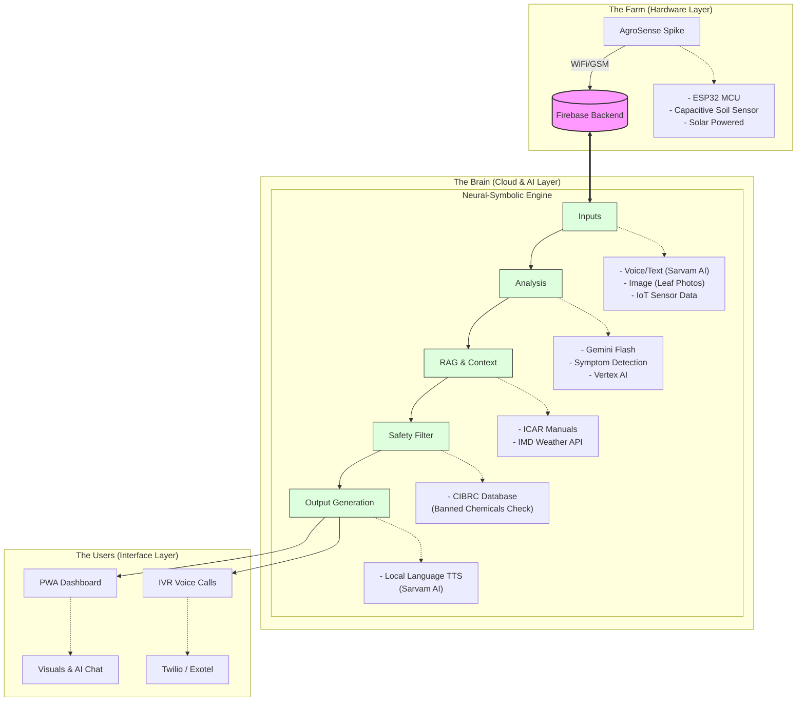

# End-to-End System Architecture: AgroWise & AgroSense

This document outlines the "Sense-Analyze-Act" feedback loop that powers the AgroWise ecosystem. The architecture is designed for high-reach (feature phones) and high-tech (smartphones) accessibility.

## 1. Visual Architecture (Mermaid)

---

## 2. Component Breakdown

### A. The Farm (Edge Device)
*   **AgroSense Spike:** A low-cost (< ₹800), solar-powered IoT device.
*   **Edge Logic:** Uses ESP32 deep-sleep mode to conserve power, waking up to transmit soil moisture, temperature, and humidity directly to the cloud.

### B. The Brain (Cloud Engine)
*   **Firebase Backend:** Acts as the central data orchestrator.
*   **Neural-Symbolic Engine:** 
    *   **Multi-Modal Inputs:** Processes voice (Sarvam AI), images (Computer Vision), and raw sensor telemetry.
    *   **AI Analysis:** Uses **Gemini Flash** (Vertex AI) for rapid symptom detection and explanation.
    *   **Contextual RAG:** Cross-references findings with official ICAR disease manuals and real-time IMD weather data (to suppress irrigation alerts if rain is imminent).
    *   **Safety Layer:** Filters recommendations against the CIBRC database to ensure no banned or harmful chemicals are suggested to farmers.

### C. The Users (Omnichannel Delivery)
*   **AgroWise PWA:** High-fidelity dashboard for smartphone users featuring visual "Soil Thirst" gauges and interactive AI chat.
*   **Kisan-Vani (IVR):** Automated voice calls via Twilio/Exotel for feature phone users, bridging the digital divide with local language support (Sarvam AI).

---

## 3. Key Differentiation
> **"Not just classification."**
> Unlike traditional AG-Tech, the engine explains **WHY** a disease occurred and **WHEN** to act, combining ground-truth telemetry with symbolic scientific knowledge.